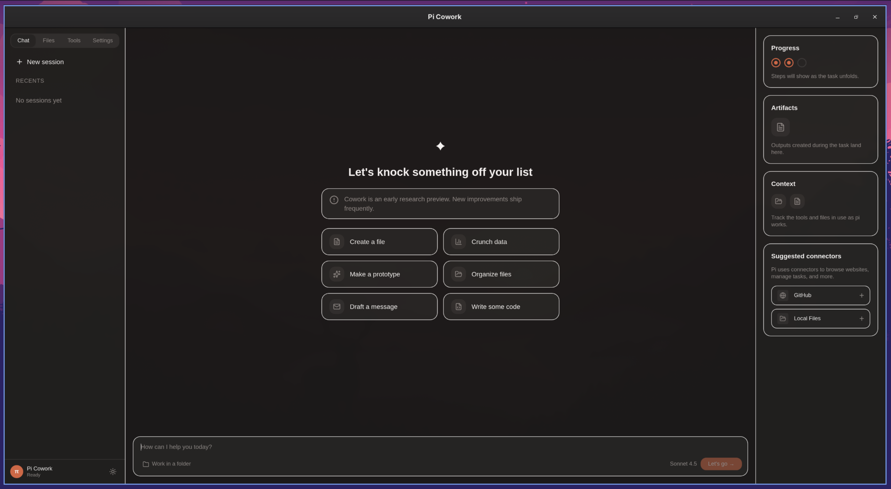

# Zosma Cowork

[English](./README.md) | **中文** | [Español](./README.es.md) | [日本語](./README.ja.md) | [Deutsch](./README.de.md) | [Français](./README.fr.md) | [Português](./README.pt.md) | [Русский](./README.ru.md) | [한국어](./README.ko.md) | [हिंदी](./README.hi.md)

[](https://github.com/zosmaai/zosma-cowork/actions/workflows/ci.yml)
[](https://github.com/zosmaai/zosma-cowork/actions/workflows/release.yml)
[](https://opensource.org/licenses/MIT)

> 由 [pi agent SDK](https://github.com/Dicklesworthstone/pi_agent_rust) 驱动的桌面 AI 协作者 — 流式传输、思维过程、工具调用、多轮会话和引导，全部集成在一个精美的原生应用中。



## 功能特性

- **进程内代理运行时** — pi agent SDK 直接在应用内运行（无子进程，运行时无需 CLI）
- **多轮会话** — 完整的对话连续性，持久化会话历史
- **流式响应** — 实时观看代理思考、编写代码和调用工具
- **思维块** — 可展开查看模型的推理过程
- **工具调用时间线** — 实时显示 bash/edit/write 工具调用及其参数和结果
- **会话管理** — 持久化聊天会话保存至 `~/.zosmaai/cowork/`
- **亮色与暗色模式** — 暖色奶油亮模式和暖色炭灰暗模式
- **键盘快捷键** — `Cmd/Ctrl+Shift+K` 聚焦输入框，`Cmd/Ctrl+N` 新建会话
- **中止与引导** — 中途停止运行中的代理，发送后续引导消息
- **Claude 风格 UI** — 三栏布局：侧边栏、工作区和信息面板

## 技术栈

| 层级 | 技术 |
|------|------|
| 前端 | React 19, Tailwind CSS v4, Radix UI |
| 桌面壳 | Tauri v2, Rust, Tokio |
| 代理引擎 | [metaagents](./metaagents/) — `pi_agent_rust` SDK 的 Rust 封装 |
| 代理 SDK | [`pi_agent_rust`](https://github.com/Dicklesworthstone/pi_agent_rust) — 内置 QuickJS 扩展的进程内运行时 |
| 测试 | Vitest, Testing Library, jsdom, `cargo test` |
| 代码规范 | Biome（前端），Clippy（Rust） |

## 快速开始

### 前置条件

- [Node.js](https://nodejs.org/) 22+
- [Rust](https://rustup.rs/) 1.85+

### 安装与运行

```bash
# 安装依赖
npm install

# 运行前端开发服务器
npm run dev:frontend

# 运行完整 Tauri 应用（前端 + Rust 后端 + metaagents 引擎）
npm run dev
```

## 配置与数据

| 内容 | 位置 | 说明 |
|------|------|------|
| LLM 提供商和 API 密钥 | `~/.zosmaai/agent/settings.json` | 由应用管理 |
| 模型定义 | `~/.zosmaai/agent/models.json` | 由应用管理 |
| 扩展和技能 | `~/.zosmaai/agent/extensions/` | 本地扩展目录 |
| 会话历史 | `~/.zosmaai/cowork/` | 由 Zosma Cowork 管理 |

## 许可证

MIT © [Zosma AI](https://zosma.ai)
